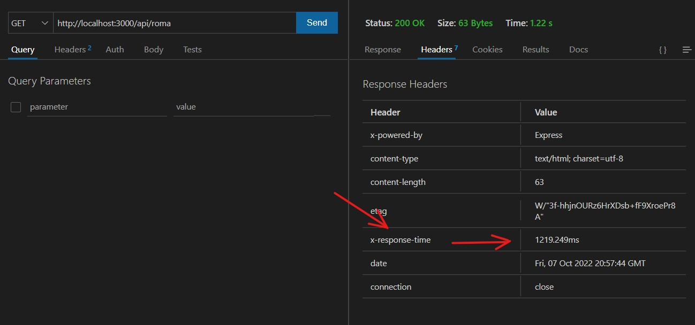

# Challenge

## Instalación:

- Clonar el repositorio
- Intalar dependencias a través de consola con el comando ->  npm i

## Instrucciones de uso:

- Para iniciar el servidor, comando -> npm start
- Una vez iniciado el servidor accedemos a una petición mediante una url similar a esta -> http://localhost:3000/api/roma 

Es decir http://localhost:3000/api/ + [ciudad a buscar]

 
Nos entregará la temperatura actual consultando a una api externa, podemos chequerarlo en el texto recibido: "Source: API weather". Si Consultamos nuevamente la misma ciudad, esta será traida de nuestra base de datos mongoDB, por lo que veremos "Source: DB"
  
En caso que la petición a la API externa falle, el código hará dos intentos más y en caso de una respuesta negativa, devolverá un error explicando el motivo. 
  
    
     
## Tests:
- Sin el servidor activo, podemos correr los tests con el comando -> npm test
- tendremos un contador de errores para corroborar los 3 intentos, en caso de introducir una ciudad inexistente o un problema en la API externa (observar imagen). 
- Los test a diferencia del resto del código fueron escritos en español para una mejor comprensión del usuario.

## Header de tiempo de respuesta:
- Contamos con un header de respuesta con el nombre "x-response-time", implementado a través de un middleware, que mide el tiempo de respuesta en ms (observar imagen).

